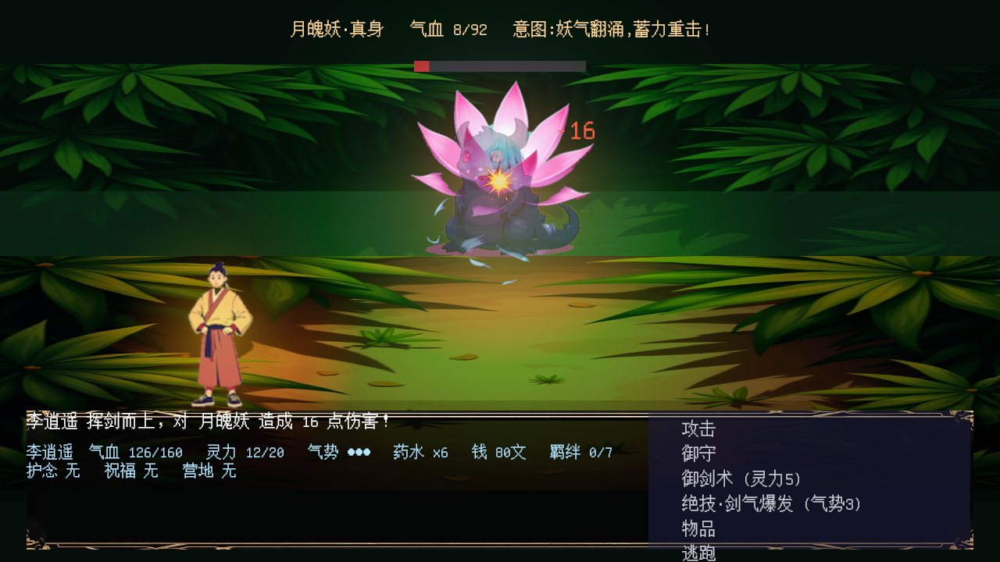

# 御剑行 · 轮回 (Love RPG)

仙侠风 **肉鸽回合制 RPG**,用 Bevy 0.19 代码优先构建,美术全部由
ComfyUI(Flux 静帧 + Wan2.2 过场动画)生成。

**▶ 在浏览器游玩:<https://xiongchenyu6.github.io/bevy-open-rpg/>**(需要
WebGPU:最新 Chrome / Edge,或 Firefox 开启 `dom.webgpu.enabled`)




## 玩法

一局一世,全程走在真实可行走的程序化地图上:

- **地图即世界**:元胞自动机生成有机地形,散布未知「?」迷雾标记——
  走上去才揭晓是战斗、奇遇、剧情、歇脚还是集市;洞天晶石、河灯、
  瘴铃、镜廊、雷鼓、旧梦灯等可见机关会计入主线进度。宝箱可能是宝箱妖,
  灵泉回血,路人会给出可领取的「路人签」小委托并追踪本程目标,
  回执会降低本章草地遇敌压力,并在本章首领战开局触发「首领照应」,
  瘴气毒格可见可绕。每程有
  独立探索迷雾:当前视野揭开,已走过的区域保留浅雾记忆。
  清完标记走青石界门进下一程。
- **连续旅程**:七卷共 41 段主线路标,每一程都有地点名、当前目标和
  界门提示,并按段落绑定“余杭、洞天、江岸、疫雨、京华、南疆、终门”
  对应地貌;Run 地图会使用 15 张手工地图的真实拓扑蓝图,再按程数改变
  进路和地貌细节,而不是只给同一张随机图换贴图。每段入图播放一次队伍对白,并锁定战斗、剧情、歇脚、
  集市、机关或强袭的内容节奏。七卷时长预算合计 600 分钟,每程
  主线契约会显示本程约几分钟、必做内容清单和本卷时长焦点。入图会展开本程「主线契约」,确认
  「领取并追踪」后写入任务札,HUD/行囊持续显示签收状态、完成条件
  与主线标记进度;清完主线标记后踩界门会先交付归档,再领取下一程
  路引。行囊也记录「机关破除」、可选「路人签/路人回声」、本章「路况」
  与「首领照应」和「营火照应」;
  歇脚节点会按当前章节与队伍给出营地对白,并选择下一战消耗的「营策」
  (调息、剑守、灵护、凝灵)。灵儿、剑姊、南瑶会按剧情进度在地图和
  run-mode 战斗中随行现身,并带来回血、追击、回灵与后期仙术反馈。
  21 个必做「缘」节点由 22 个章内选择场景覆盖,同一章优先抽取未看
  场景;HUD/结局记录「缘忆」数量,南疆与终卷场景会显示对应同伴立绘。
  HUD、行囊与结局会记录本局总计及分卷实测用时。固定种子自动审计已能
  走通 41/41 段、归档 41/41 份主线签并取得 7/7 章印;它只证明流程与
  账本闭环。600 分钟仍是内容设计预算,不是玩家实测通关时长结论。
- **主线路书**:剧情探索模式的每个主线阶段也写成「主线簿」,
  标出卷内第几步、签号、地点、联络人和当前动作;NPC 主线确认页、
  任务簿 HUD 和右上追踪卡都会同步显示。
- **委托裁断**:支线交付不再只是领奖,可选「稳妥封存」或「追查余波」;
  追查会写入归档街谈,并加强对应路线的「委托清障」路况收益。
- **委托步骤**:14 条本地支线都有签收→现场步骤→交付裁断的流程,
  领取时会弹出签收回执,任务板、委托契约、HUD 追踪和现场推进消息都会
  显示当前步骤与下一步;到现场可选「细查现场」或「快断余妖」,回执会
  影响对应路线的路况与 NPC 街谈。
- **NPC托付**:普通路人也会给跨地图小托付,8 条托付覆盖竹林、水月、
  江岸、瘴雨、京华、镜廊、南疆和终门;确认接下后写入托付追踪,
  交给目标 NPC 结算回礼,并留下 `托付回声` 稳住对应路线压力。
- **任务引路**:右侧追踪卡会按当前地图判断主线、委托和 NPC 托付是
  当前目标、交付点,还是需要前往的下一处地点。
- **界门过场**:通过光门换图时会显示去向、章节签号、落点判断和当前
  目标,让章节旅行不只是踩格切图。
- **路线报路**:野外路线分支处理后,回当地非关键 NPC 可归档一份「路报」
  并领取回礼;HUD 记录 `路报 x/6`,让探索选择有回城交付。
- **小传回访**:完成月衡或南瑶的同伴小传后,回对应路线与普通 NPC 交谈
  会出现专属地方反馈并领取一次性回礼;漏看小传则只留下街谈、路标提示
  与更高的遇妖压力,终章两段誓言可在同一次回访中分别结清。
- **迟来补访**:错过早中期小传不会永久丢档;瘴雨、南疆、终门会分别
  出现「旧栅余声」「照影迟问」「雷纹归愿」补访签,完整经历 NPC 领取、
  野外路印触发迟来小传、回交托人归档三步,任务引路、地图标记和 HUD
  会持续追踪,补完后解除对应路段压力并结算回礼。
- **本卷誓记**:每章「缘」剧情的选择会立下护心、破势或同心誓记,
  写入行囊与结局;章末 Boss 开场会读取本卷誓记,压低攻势或先破气血。
- **读招回合制**:敌人每回合预告下一手(张爪/蓄力重击/凝气/摄灵),
  「御守」卸力回灵、气势满三层放「绝技·剑气爆发」——每回合都是决策。
- **七位章末 Boss**:战前对峙台词,半血「真身」变身,各有专属机制
  (镜界反噬、雷劫连环、根须再生……);终章宿命水影会读你这一世的
  道心与情缘,决定以情乱心还是以剑势压人。
- **无等级成长**:22 件法宝按持有叠加;道心/情缘里程碑直接反哺战斗;
  每卷 Boss 结算授予章印并触发境界突破,探索剧情模式也会把七卷章印
  写入 HUD/追踪卡与终章回响。
- **有记忆的剧情**:29 个奇遇(含白狐三遇、盲女琴师二遇等跨图事件链,
  初遇的选择决定后文),11 场「缘」剧情,四种结局 + 按本局抉择生成的
  结局回响。

## 操作

- 方向键/WASD 移动 · 走到「?」揭晓 · ESC 行囊(纸娃娃/法宝/里程碑)
- 战斗:上/下选指令,空格确认;对话:空格推进,上/下选选项

## 本地运行

需要 Rust 1.95+(NixOS 用户直接 `nix develop` / direnv):

```bash
cargo run --bin love-rpg          # 桌面(Wayland)
bash scripts/build_web.sh         # 构建 wasm 到 web/
python3 scripts/serve_web.py      # 本地预览 web 构建
bash scripts/run_audit.sh /tmp/love-rpg-run-audit  # 41 段全流程审计
```

## 架构与美术管线

- `STRUCTURE.md` — 模块架构;`PLAN.md` — 十三轮迭代记录;
  `ASSETS.md` — 生成式美术管线(远程 ComfyUI:Flux 静帧、地砖、
  立绘、UI 框,Wan2.2 i2v 章节过场动画)。
- CI(`.github/workflows/deploy-wasm-pages.yml`)在每次 push main 时
  构建 wasm → 发布 `web-latest` Release → 部署 GitHub Pages。

姊妹项目:[protect-carrot](https://github.com/xiongchenyu6/protect-carrot) ·
[bevy-open-rts](https://github.com/xiongchenyu6/bevy-open-rts)
